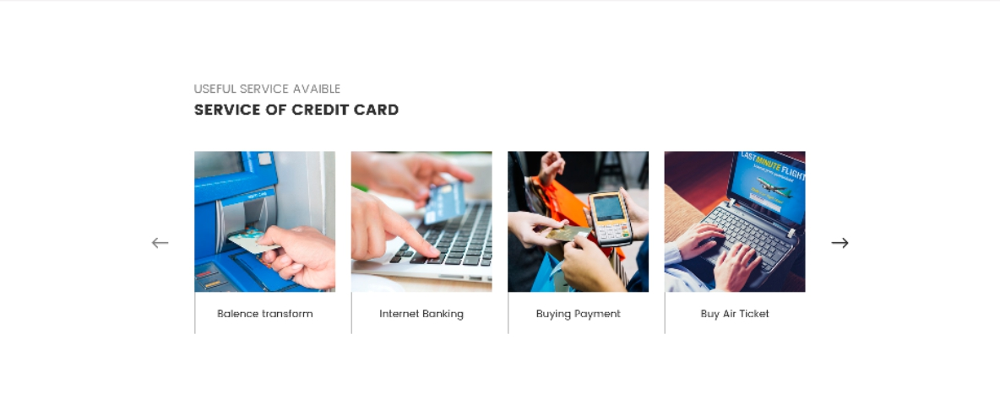

# Тестовое задание для HTML-технолога

1.	Требуется реализовать вёрстку [макета](/source/test.psd) в формате *.psd

2.	Верстка должна быть адаптивная для мобильных устройств

3.	При верстке использовать flexbox, в именовании классов применять подход BEM и использовать препроцессор Sass

4.	В блок "Easy process" добавить красивый эффект анимации при наведении.

5.	Реализовать простую карусель (можно использовать JQuery)

6.	Шрифты можно найти на https://fonts.google.com/

7.	:warning: НЕ использовать Bootstrap
